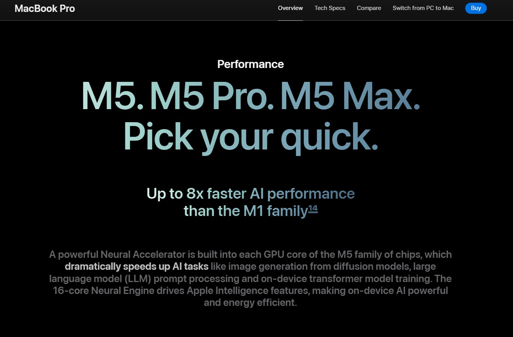

# TruthLens

## What is TruthLens?
- TruthLens is a chrome extension which tells you real benchmarks of processors and graphic cards obtained from reliable sources when you visit the official site of the product so that you won't become a fool by buying a costly item just to end getting ~10-15% better performance than last generations of hardware.
- For example Apple's website, when you visit the official site of Apple for buying MacBook Pro [Apple's website for Macbook Pro](https://www.apple.com/in/macbook-pro/) Apple is marketing the M5 Family Chips "Up to 8x faster AI performance than the M1 family" , well then you will ask what is wrong with that?? Well the M1 chip was released on November 17, 2020 and the Base M5 chip was released on October 15, 2025 followed by M5 Pro and M5 Max on March 3, 2026. They are comparing the AI performance of M5 with a 5-6 years old M1 chip, that does not seem to be optimal because we all know that how quickly new and better technology is emerging every day, every month and every year. Also have you noticed the "Up to....." key word in the image, so the 8x faster AI performance is not even guaranteed, yes it is true for some workflows but not exactly for every type of workflows. Now if you really look up at the comparison between M5 and M1, M5 represents a ~79% leap in single-core CPU performance and a ~100-150% of leap in multi-core and graphics performance, wow big numbers right?? but wait!! What if we compare it with last generation, the M4 one? Overall for normal CPU processing M5 is only ~10-20% better than M4, well M5 have massive leap in graphics around ~30-45% more than M4, and UP TO 300% (4x) surge in peak AI computing.
- So my point is that why is Apple comparing their latest chip (M5) with a 5 year old chip (M1), it is clearly not optimal with the rapid growth in tech nowadays, and also there are many more tech companies that do this.
- So my chrome extension will show the customer the real benchmarks of the processors and graphic card, directly comparing it with previous generation and will use AI to provide a summary by comparing benchmarks of a hardware form multiple reliable sources.

---

🚧 Under construction 🚧